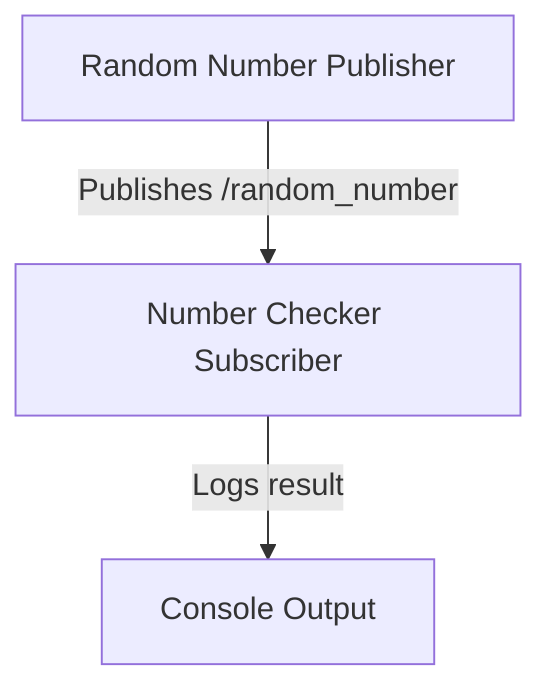

# ROS 2 Random Number Checker

## 1. Projekt leírása
Ez a projekt egy egyszerű ROS 2 alkalmazás, amely egy **véletlenszám-generátort** (
publisher) és egy **ellenőrző node-ot** (subscriber) tartalmaz. A publisher **véletlenszámokat**
generál és elküldi a ROS topic-ra, a subscriber pedig ellenőrzi, hogy a szám **páros vagy páratlan**, majd kiírja az eredményt a konzolra.

---

## 2. Telepítés és build

### **2.1. Klónozd a repository-t**

```bash
mkdir -p ~/ros2_ws/src
cd ~/ros2_ws/src
git clone https://github.com/YOUR_USERNAME/ros2-random-checker.git
cd ~/ros2_ws/
```
*(Cseréld ki `YOUR_USERNAME`-t a GitHub felhasználónevedre!)*

### **2.2. Buildelés**

```bash
colcon build --packages-select random_checker
source install/setup.bash
```

Ha sikeres volt a fordítás, folytathatod az indítással.

---

## 3. A program futtatása

### **3.1. Indítás launch fájllal**
A programot egyetlen paranccsal is indíthatod:
```bash
ros2 launch random_checker random_number_launch.py
```
Ha minden jól működik, a terminálban ezt kell látnod:
```
[INFO] [random_number_publisher]: Publishing: 42
[INFO] [number_checker_subscriber]: 42 is even
[INFO] [random_number_publisher]: Publishing: 17
[INFO] [number_checker_subscriber]: 17 is odd
```

### **3.2. Node-ok indítása külön**

Ha külön akarod futtatni a node-okat:

**Publisher indítása:**
```bash
ros2 run random_checker random_number_publisher
```
**Subscriber indítása egy másik terminálban:**
```bash
ros2 run random_checker number_checker_subscriber
```

Ha helyesen futnak, a subscriber kiírja, hogy a szám páros vagy páratlan.

---

## 4. Mermaid diagram
A következő Mermaid diagram szemlélteti a **node-ok** és a **topic** kapcsolatát:



---

## 5. Hibakeresés

### **5.1. A launch fájl nem indul**
Ha a launch fájl nem indul, ellenőrizd az alábbiakat:
- **Engedélyek beállítása**:
  ```bash
  chmod +x launch/random_number_launch.py
  ```
- **Telepítve van-e a launch fájl?** Ellenőrizd, hogy benne van a CMakeLists.txt-ben:
  ```cmake
  install(DIRECTORY launch/
    DESTINATION share/${PROJECT_NAME}/
  )
  ```
- **Package.xml ellenőrzése**: Tartalmazza-e a launch függőséget?
  ```xml
  <exec_depend>launch</exec_depend>
  ```

### **5.2. A topic nem működik**
Ellenőrizd, hogy a topic valóban létezik:
```bash
ros2 topic list
```
Majd nézd meg az üzeneteket:
```bash
ros2 topic echo /random_number
```

Ha semmi nem jelenik meg, akkor lehet, hogy a publisher nem fut.

---


